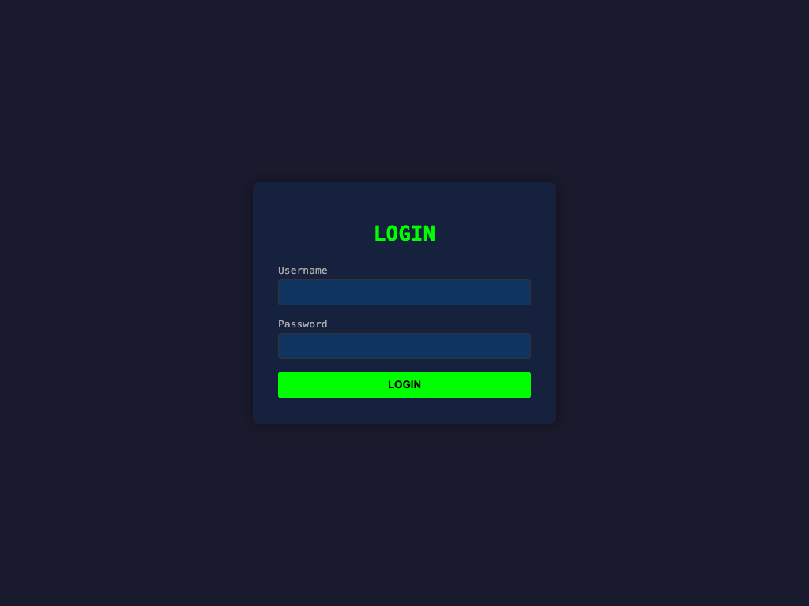
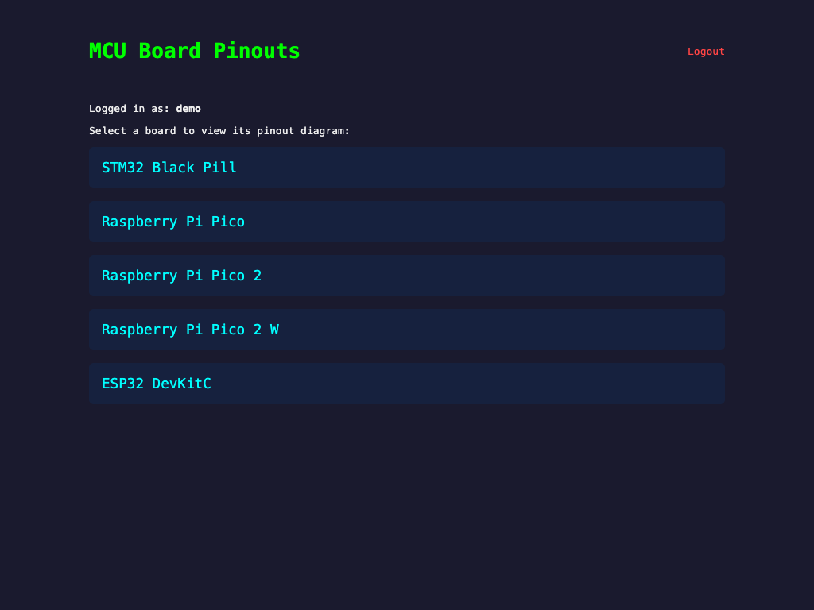
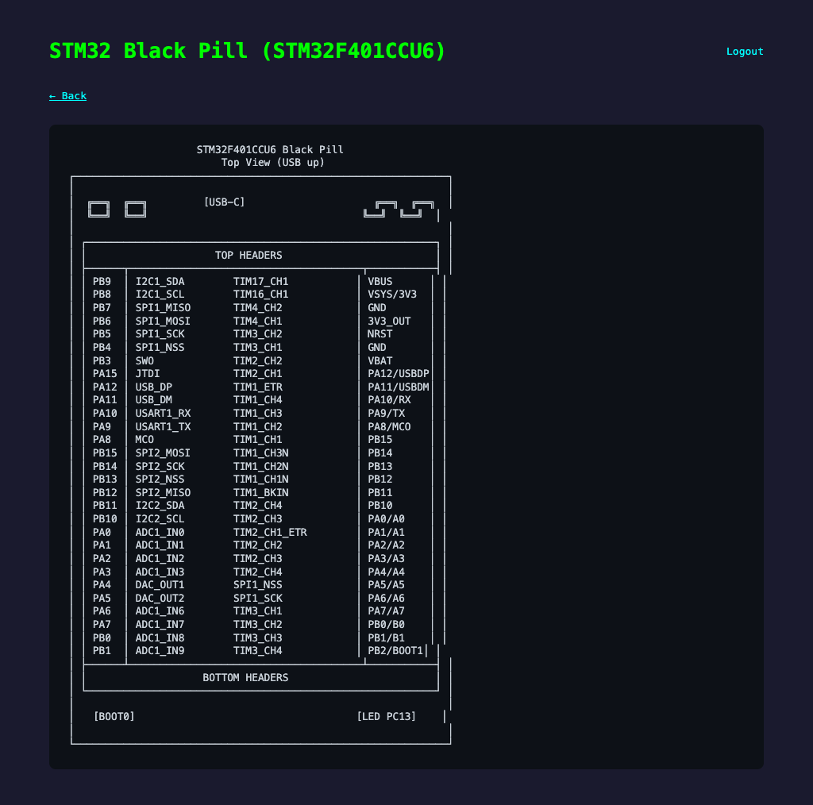

# MCU Board Pinout Viewer

A Node.js web application that displays ASCII pinout diagrams for popular microcontroller boards. Features login authentication with SQLite3 database.

## Features

- User authentication with session-based login
- SQLite3 database for user storage
- ASCII pinout diagrams for 5 popular MCU boards
- Dark-themed responsive UI

## Boards

| Board | Chip |
|-------|------|
| STM32 Black Pill | STM32F401CCU6 |
| Raspberry Pi Pico | RP2040 |
| Raspberry Pi Pico 2 | RP2350 |
| Raspberry Pi Pico 2 W | RP2350 + CYW43439 |
| ESP32 DevKitC | ESP-WROOM-32 |

## Screenshots

### Login Page



### Dashboard



### Pinout Diagram



## Setup

```bash
npm install
node index.js
```

Visit `http://localhost:3000` and log in with credentials:

| Username | Password |
|----------|----------|
| `demo`   | `demo`   |

## Tech Stack

- **Express** — web framework
- **better-sqlite3** — database
- **express-session** — session management
- **EJS** — templating
